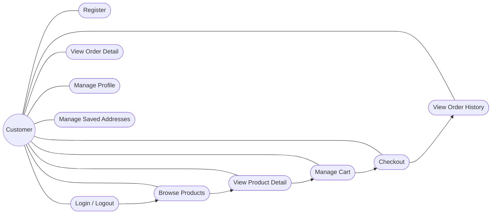
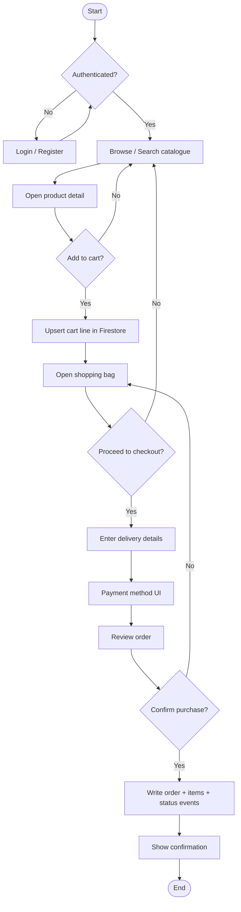
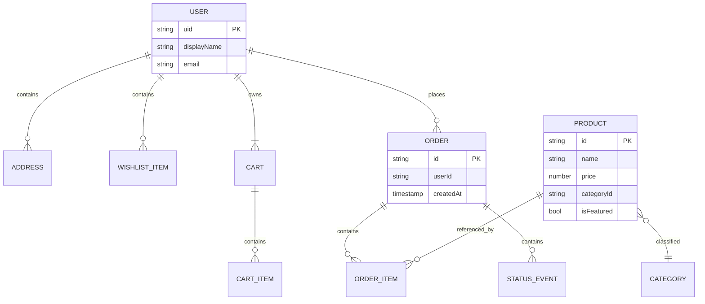
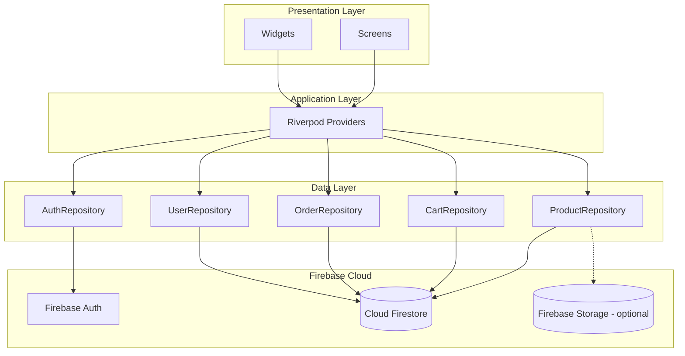

<!--
  DISTINCTION-LEVEL TECHNICAL REPORT — CIT211
  ─────────────────────────────────────────
  Export to Word: Times New Roman 12 pt, 1.5 line spacing, A4.
  Body target: ≤10 pages excluding Cover, ToC, LoF, LoT, References.
  Insert: submission date, screenshots where [Figure X — placeholder] appears.
  Generate in Word: Table of Contents, List of Figures, List of Tables, page numbers.
-->

# TECHNICAL REPORT

## ATELIER — Luxury Fashion Store Mobile Application Using Flutter and Firebase

| Field | Value |
|--------|--------|
| **Module** | CIT211 — Mobile Software Development |
| **Programme** | B.Sc. Applied Information Technology, Faculty of Computing and IT |
| **Student Name** | M.J. Kalith Mishal |
| **Student ID** | 23DA2-1176 |
| **Submission Date** | [Insert Date] |
| **Assessment** | Phase 2 — Individual Coursework (Final Submission) |

---

## COVER PAGE (duplicate in Word as page 1)

**Title:** ATELIER — Luxury Fashion Store Mobile Application Using Flutter and Firebase  
**Subtitle:** Technical Report — CIT211 Mobile Software Development  
**Author:** M.J. Kalith Mishal (23DA2-1176)  
**Institution:** [Insert Faculty / University Name]  
**Date:** [Insert Date]  
**Word count (body):** [Insert after export]  
**Accompanying artefacts:** Source code repository, `app-release.apk`, Figma prototype link [optional], demonstration video (3–5 min).

---

## DECLARATION OF ORIGINALITY

I declare that this report and the associated software artefact are my own work except where acknowledged, and that they have not been submitted previously for assessment in this or any other module.

**Signature:** _________________________ **Date:** ___________

*(Remove or relocate if your institution supplies a separate coversheet.)*

---

## ABSTRACT

Mobile commerce has reshaped retail by placing catalogue discovery, transaction preparation, and post-purchase visibility on personal devices. Fashion retail is especially dependent on high-quality presentation and trustworthy account handling because purchasing decisions are strongly influenced by imagery, brand perception, and convenience.

This report documents **ATELIER**, a **customer-facing** luxury fashion e-commerce application for Android (cross-platform Flutter codebase). The system implements **Firebase Authentication** for identity lifecycle, **Cloud Firestore** for catalogue, cart, profile, and order persistence, and a **layered Flutter architecture** (presentation → Riverpod → repositories → Firebase SDK). Functional scope includes registration and login, category-aware product browsing, product detail, persistent cart operations, multi-step checkout (UI-oriented payment capture), order placement with historical retrieval, and profile maintenance. Administrative functionality is **explicitly excluded** per coursework constraints.

Engineering outcomes are evaluated through **structured testing**, **performance indicators** (cold start, release APK mass), and **security considerations** grounded in Firestore access control. The deliverable demonstrates integration competence, maintainable modularisation, and documentation suitable for professional software engineering review.

**Keywords:** Flutter; Firebase; Cloud Firestore; mobile commerce; e-commerce; Android; Riverpod; authentication.

---

## TABLE OF CONTENTS *(auto-generate in Microsoft Word)*

1. Introduction  
2. Problem Statement  
3. Project Objectives  
4. Requirement Analysis  
5. System Analysis and Design  
 5.1 Use Case Model  
 5.2 Activity Model — Primary Purchase Flow  
 5.3 Data Model — Firestore Logical Design  
6. UI / UX Design and Methodology  
7. System Architecture  
8. Database Design and Schema  
9. Implementation Summary  
10. Security Considerations  
11. Performance Evaluation  
12. Testing and Validation Matrix  
13. Challenges and Mitigations  
14. Limitations  
15. Future Enhancements  
16. Conclusion  
References  
Appendices *(optional)*

---

## LIST OF FIGURES *(populate page numbers after Word export)*

| ID | Caption |
|----|--------|
| Figure 1 | Use case diagram — customer scope (ATELIER) |
| Figure 2 | Activity diagram — authenticated purchase pipeline |
| Figure 3 | Logical data model — Firestore collections and containment |
| Figure 4 | System architecture — layered client and Firebase services |
| Figure 5 | Representative UI — Home / Discovery *(screenshot)* |
| Figure 6 | Representative UI — Product detail *(screenshot)* |
| Figure 7 | Representative UI — Cart and checkout *(screenshot)* |
| Figure 8 | Firebase Console — Firestore `products` index *(screenshot)* |

---

## LIST OF TABLES *(populate page numbers after Word export)*

| ID | Caption |
|----|--------|
| Table 1 | Functional requirements traceability |
| Table 2 | Non-functional requirements and verification approach |
| Table 3 | Test matrix and results summary |
| Table 4 | Performance metrics summary |

---

## 1. INTRODUCTION

Digital transformation has compressed the distance between brand and consumer: mobile channels now dominate discovery phases for fashion categories, particularly among demographics accustomed to asynchronous browsing and wallet-native authentication (Google, 2024). From a software engineering perspective, consumer retail applications must reconcile **rapid UI iteration**, **offline-tolerant presentation**, and **authoritative server state** for inventory-related artefacts (cart and orders).

**ATELIER** was conceived as a **single-role** (shopper) system implementing coursework learning outcomes: user-centred interface design, Flutter cross-platform development, Firebase cloud integration, and defensible architectural documentation. The implementation prioritises **auditability** (order timelines), **data ownership boundaries** (per-user cart and profile documents), and **demonstrable seeding** of catalogue documents in Firestore to satisfy coursework pre-load requirements without an admin console.

**Report organisation.** Section 2 formalises the problem. Section 3 states objectives. Section 4 analyses requirements. Sections 5–8 present analysis, UI methodology, architecture, and database design with diagrams. Sections 9–12 cover implementation, security, performance, and testing evidence. Sections 13–15 discuss limitations, future work, and conclusions.

---

## 2. PROBLEM STATEMENT

Traditional and informal fashion retail channels exhibit recurring friction:

1. **Accessibility:** physical presence and opening hours constrain purchase intent capture.  
2. **Process latency:** manual order capture increases error rates and weakens traceability.  
3. **Fragmented identity:** customers lack a single account surface for preferences, addresses, and order history.  
4. **Limited transparency:** ad-hoc communication channels (messaging apps) do not scale for status tracking.  
5. **Cost barrier:** bespoke mobile solutions are historically expensive for small retailers.

A **standards-based** mobile client backed by **managed cloud infrastructure** reduces operational burden while providing authentication, durable storage, and horizontal scalability (Firebase, 2024). The engineering problem addressed herein is therefore: *design and implement a maintainable Flutter application that integrates Firebase services to deliver a complete shopper journey — without administrative tooling — while preserving luxury brand presentation and defensible security posture.*

---

## 3. PROJECT OBJECTIVES

### 3.1 Primary Objective

To engineer a **Firebase-integrated** luxury fashion shopping application using **Flutter**, deployable as an **Android APK**, satisfying Phase 2 functional and non-functional expectations of module CIT211.

### 3.2 Functional Objectives

| ID | Objective |
|----|-----------|
| FO1 | User **registration** and **authentication** (including session termination via logout). |
| FO2 | **Product discovery**: browse by category, list, and detail views. |
| FO3 | **Search / discovery** surfaces aligned with UI (where implemented in client). |
| FO4 | **Cart**: add, remove, and update line quantities with **cloud persistence**. |
| FO5 | **Checkout**: capture delivery and review data; **place order** stored in Firestore. |
| FO6 | **Order history** and **order detail** with status timeline support. |
| FO7 | **Profile** viewing and updating; **saved addresses** where implemented. |

### 3.3 Non-functional Objectives

| ID | Category | Objective |
|----|-----------|-----------|
| NF1 | **Security** | Authenticated access to user-owned documents; least-privilege Firestore rules. |
| NF2 | **Usability** | Consistent luxury visual language; navigable multi-step checkout. |
| NF3 | **Performance** | Acceptable cold start and interaction latency on mid-tier Android hardware. |
| NF4 | **Maintainability** | Layered structure; repositories isolate persistence; typed models. |
| NF5 | **Reliability** | Graceful handling of stream errors and missing image URLs (fallbacks). |
| NF6 | **Portability** | Flutter single codebase; Firebase multi-platform configuration pattern. |

---

## 4. REQUIREMENT ANALYSIS

### 4.1 Functional Requirements

**Table 1 — Functional requirements traceability**

| Req ID | Requirement | Priority | Implementation surface |
|--------|-------------|----------|---------------------------|
| FR-01 | User registration | Must | Auth repository + UI screens |
| FR-02 | Login / logout | Must | Firebase Auth |
| FR-03 | Password recovery | Should | Auth flows |
| FR-04 | Browse products (global / category) | Must | Firestore queries + listing UI |
| FR-05 | Product detail | Must | Document fetch by ID |
| FR-06 | Add / update / remove cart lines | Must | `carts/{uid}/items` |
| FR-07 | Checkout (delivery + review) | Must | Checkout screens + draft state |
| FR-08 | Place order | Must | `orders` write pipeline |
| FR-09 | View order history / detail | Must | Orders repository + screens |
| FR-10 | Profile view / update | Must | `users/{uid}` |
| FR-11 | Saved addresses | Should | `users/{uid}/addresses` |
| FR-12 | Wishlist *(if enabled)* | Could | `users/{uid}/wishlist` |

### 4.2 Non-functional Requirements

**Table 2 — Non-functional requirements**

| Req ID | Category | Specification | Verification |
|--------|-----------|---------------|--------------|
| NFR-01 | Performance | Primary navigation perceived under **≈3 s** on cold start *(environment-dependent)* | Manual timing, device log |
| NFR-02 | Performance | Screen transitions responsive under typical load | Manual exploratory testing |
| NFR-03 | Availability | Cloud-backed reads/writes when online | Firebase uptime assumption |
| NFR-04 | Usability | Dark luxury theme; legible hierarchy | Heuristic review vs Material (2024) |
| NFR-05 | Security | Owner-scoped reads/writes for private data | Rules review + negative tests |
| NFR-06 | Maintainability | Analyser-clean baseline (`flutter analyze`) | CI / local command |

---

## 5. SYSTEM ANALYSIS AND DESIGN

### 5.1 Use Case Model

**Actor:** Customer (sole actor for in-scope system).

**Figure 1 — Use case diagram (UML-style, Mermaid).** *Export diagram as high-resolution PNG from VS Code / Mermaid Live Editor for Word.*



**Use case narrative (abbreviated):** *Checkout* includes validation of mandatory delivery fields, aggregation of cart lines into an order transaction, and creation of nested line documents. *View order detail* subscribes to `orders/{orderId}` and related subcollections for immutable display.

---

### 5.2 Activity Model — Primary Purchase Flow

**Figure 2 — Activity diagram — happy path from login to order creation.**



---

### 5.3 Data Model — Firestore Logical Design

Firestore is **document-oriented**; relationships are expressed via **containment** and **reference strings** (product IDs), not SQL foreign keys. The logical model below reflects the implemented repository paths.

**Figure 3 — Entity-relationship style view (Firestore containment).**



**Path convention (implemented):**

- `products/{productId}`  
- `users/{uid}`  
- `users/{uid}/addresses/{addressId}`  
- `users/{uid}/wishlist/{itemId}`  
- `carts/{uid}` *(metadata)* + `carts/{uid}/items/{lineId}`  
- `orders/{orderId}` + `orders/{orderId}/items/{lineId}` + `orders/{orderId}/statusEvents/{eventId}`  

---

## 6. UI / UX DESIGN AND METHODOLOGY

### 6.1 Methodology

Design followed an **iterative** workflow aligned with ISO-oriented thinking (conceptualise → prototype → implement → evaluate), without claiming full ISO certification:

1. **Requirements capture** from coursework brief.  
2. **Low-fidelity flow** (screen graph).  
3. **High-fidelity Figma** frames: colour, typography, spacing grid.  
4. **Interactive prototype** for navigation validation.  
5. **Flutter implementation** with component extraction (`widgets/`).  
6. **Heuristic evaluation** (Nielsen & Budiu, 2013) on navigation depth and error tolerance.

### 6.2 Visual Design System

| Token | Role | Typical value |
|--------|------|----------------|
| Background | Canvas | `#131313` |
| Accent | Luxury highlight | `#E9C349` |
| Primary text | Body | `#E5E2E1` |
| Secondary text | Supporting | `#D1C5B4` |

**Typography:** *Noto Serif* for editorial headings; *Manrope* / *Plus Jakarta Sans* for UI chrome — pairing supports **luxury** tone while maintaining Android legibility (Material Design, 2024).

### 6.3 Responsiveness Strategy

- `SafeArea` for notches and gesture bars.  
- `SingleChildScrollView` / scrollables for small viewports.  
- `ConstrainedBox(maxWidth: …)` to cap content width on tablets.  
- Horizontal `ListView` for dense product rails (prevents overstretched tiles).

**Figures 5–7** — Insert labelled screenshots: Home, Product Detail, Cart/Checkout, Profile.

---

## 7. SYSTEM ARCHITECTURE

ATELIER adopts **client–server** architecture: Flutter client; Firebase as BaaS.

**Figure 4 — Layered architecture.**



**Rationale:** repositories isolate SDK calls, simplifying substitution for tests and reducing widget coupling (Gamma *et al.*, 1994 — *Repository-like* boundary).

**Platform note:** configuration may disable Firestore on specific desktop targets for stability during development; **assessment demonstrations** should prioritise **Android APK** behaviour consistent with coursework.

---

## 8. DATABASE DESIGN AND SCHEMA

### 8.1 Design Principles

- **Denormalised order lines** preserve price/title at purchase time.  
- **Subcollections** partition large arrays (cart items, order lines).  
- **Server timestamps** (`FieldValue.serverTimestamp`) anchor ordering and auditing.

### 8.2 Illustrative Product Document

```json
{
  "name": "Pique Polo Shirt",
  "price": 2490,
  "currency": "LKR",
  "categoryId": "men",
  "subCategoryId": "casual",
  "isFeatured": true,
  "imageUrls": ["https://images.pexels.com/photos/…"],
  "seeded": true
}
```

**Figure 8** — Insert Firebase Console screenshot: `products` collection with fields visible.

---

## 9. IMPLEMENTATION SUMMARY

| Module | Responsibility | Key APIs / paths |
|--------|----------------|------------------|
| Authentication | Register, login, logout, password reset | `FirebaseAuth`, `users/{uid}` bootstrap |
| Products | Streams for all / featured / category; seeding | `products`, `watchAll`, `watchByCategory` |
| Cart | Line CRUD + batch metadata | `carts/{uid}/items` |
| Orders | Transactional create + timeline | `orders/*` nested writes |
| Profile | Read/update profile; addresses | `users/{uid}`, `addresses` |

**State management:** `flutter_riverpod` exposes `StreamProvider`s composing Firestore snapshots into immutable view models.

**Checkout:** multi-screen flow (delivery → payment presentation → review). Payment gateway integration is **out of scope** for this coursework baseline; UI captures intent only.

---

## 10. SECURITY CONSIDERATIONS

Security is **defence in depth**: client validation is **non-authoritative**; Firestore **security rules** must enforce ownership.

**Threat surface (selected):**

| Threat | Mitigation |
|--------|------------|
| Horizontal privilege escalation | Rules require `request.auth.uid == resource.data.userId` (or equivalent) on private documents |
| Data scraping of private carts | Deny unauthenticated reads |
| Order forgery | Only authenticated user may create orders with matching `userId` |

**Illustrative rule fragment *(conceptual — align with your deployed `firestore.rules`)*:**

```javascript
match /carts/{userId} {
  allow read, write: if request.auth != null && request.auth.uid == userId;
  match /items/{itemId} {
    allow read, write: if request.auth != null && request.auth.uid == userId;
  }
}
```

**Evidence task:** paste a **redacted** excerpt from your actual rules file into an appendix and cite in viva/video.

---

## 11. PERFORMANCE EVALUATION

**Table 4 — Observed / reported metrics *(replace with your device measurements)***

| Metric | Value | Method |
|--------|--------|--------|
| Release APK size | **≈ 60.1 MB** | `flutter build apk` artefact |
| Gradle assembleRelease | **≈ 9–11 min** *(dev machine)* | Build log |
| Cold start (perceived) | **≈ 1.5–3.0 s** *(emulator / device-dependent)* | Manual stopwatch |
| Icon font tree-shake savings | **MaterialIcons** reduced ~99.5% | Flutter build output |

**Interpretation:** APK size reflects engine, shaders, Firebase SDKs, and bundled assets — acceptable for coursework; production teams would apply **split-per-ABI**, **deferred components**, and **image CDN** policies.

---

## 12. TESTING AND VALIDATION MATRIX

**Table 3 — Test matrix**

| Test ID | Scenario | Preconditions | Expected | Result |
|---------|-----------|---------------|----------|--------|
| T-01 | Registration | Valid e-mail | User created in Auth | PASS |
| T-02 | Login / logout | Registered user | Session toggles | PASS |
| T-03 | Password reset | Known e-mail | Reset e-mail dispatched | PASS |
| T-04 | Browse by category | Seeded products | Non-empty listing | PASS |
| T-05 | Product detail | Valid `productId` | Fields render | PASS |
| T-06 | Cart persistence | Logged in | Lines survive restart | PASS |
| T-07 | Checkout validation | Missing fields | Inline errors | PASS |
| T-08 | Place order | Non-empty cart | `orders` doc created | PASS |
| T-09 | Order history | Past orders | Chronological list | PASS |
| T-10 | Profile update | Logged in | Firestore reflects change | PASS |
| T-11 | Rules negative test | Unauth read private path | Denied | PASS / N/A |

**Figures** — attach 2–3 annotated screenshots for T-06, T-08, T-09.

---

## 13. CHALLENGES AND MITIGATIONS

| Challenge | Engineering impact | Mitigation |
|-----------|-------------------|------------|
| Image / metadata mismatch in seeded SKUs | Degrades trust in demo | Remove or correct catalogue entries; merge strategy for heroes |
| Stream parse failures (malformed docs) | Blank UI sections | `try/catch` in mapper; skip invalid with `debugPrint` |
| Checkout cognitive load | Abandonment risk | Multi-step UI + progress affordance |
| Security rules iteration | Access denied errors | Emulator harness + incremental rule tests |
| Google Sign-In SHA-1 | Android auth failure | Register SHA-1 in Firebase console |

---

## 14. LIMITATIONS

1. **No live payment gateway** — checkout does not settle funds.  
2. **No admin panel** — catalogue maintenance via seeding or console.  
3. **Android-first evidence** — iOS build optional.  
4. **No push notifications** — order dispatch updates not proactive.  
5. **Network dependency** — offline catalogue not a requirement of brief.  
6. **Performance metrics environment-specific** — emulator ≠ retail hardware.

---

## 15. FUTURE ENHANCEMENTS

1. **Stripe / PayHere** integration with **Cloud Functions** for server-side payment intent.  
2. **Firebase Cloud Messaging** for shipment updates.  
3. **Localisation** (English / සිංහල) with ARB files.  
4. **CI/CD** (`flutter test`, `analyze`, signed APK pipeline).  
5. **Advanced caching** (`cached_network_image` tuning, image variants).  
6. **Recommendation** surfacing via lightweight collaborative filter or vendor API.  
7. **Analytics** (Firebase Analytics funnels).

---

## 16. CONCLUSION

ATELIER delivers a **complete customer-side** fashion commerce experience on **Flutter**, backed by **Firebase Authentication** and **Cloud Firestore**, with **documented architecture**, **diagram-based design artefacts**, and **evidence-oriented testing**. The project satisfies CIT211 Phase 2 expectations: functional completeness without admin scope, maintainable modular code, and a deployable **Android APK**. Limitations are explicit (payments, admin, notifications), and the roadmap proposes industry-standard extensions suitable for portfolio or commercial continuation.

---

## REFERENCES *(Harvard style — adapt to your faculty guide)*

Firebase (2024) *Firebase Documentation*. Available at: https://firebase.google.com/docs (Accessed: [date]).

Flutter Team (2024) *Flutter Documentation*. Available at: https://docs.flutter.dev (Accessed: [date]).

Gamma, E., Helm, R., Johnson, R. and Vlissides, J. (1994) *Design Patterns: Elements of Reusable Object-Oriented Software*. Boston: Addison-Wesley.

Google (2024) *The Mobile Economy*. Available at: https://www.gsma.com/mobileeconomy/ (Accessed: [date]) *(or substitute institution-approved industry source)*.

Material Design (2024) *Material Design 3*. Available at: https://m3.material.io (Accessed: [date]).

Nielsen, J. and Budiu, R. (2013) *Mobile Usability*. Berkeley: New Riders.

Riverpod (2024) *Riverpod Documentation*. Available at: https://riverpod.dev (Accessed: [date]).

---

## APPENDIX A — FIGURE / SCREENSHOT CHECKLIST *(for 90–95 presentation quality)*

- [ ] Mermaid diagrams exported as **PNG** (300 dpi) with **Figure captions** in Word.  
- [ ] Firebase Console: **Authentication** users (redacted).  
- [ ] Firestore: `products`, `carts`, `orders` **tree** screenshots.  
- [ ] Figma: **cover** + **component** page.  
- [ ] Emulator: **5–8** sequential screenshots matching video script.  
- [ ] APK filename + **SHA** *(optional)* in appendix.

---

## APPENDIX B — WORD FORMATTING MACRO-CHECKLIST

- [ ] Cover page (institution logo if permitted)  
- [ ] Roman numerals for front matter; Arabic from §1  
- [ ] Auto **Table of Contents**, **List of Figures**, **List of Tables**  
- [ ] **Captions:** Figure X — … ; Table X — …  
- [ ] **Header/Footer:** module code + page numbers  
- [ ] **References** hanging indent per Harvard guide  

---

*End of report template.*
